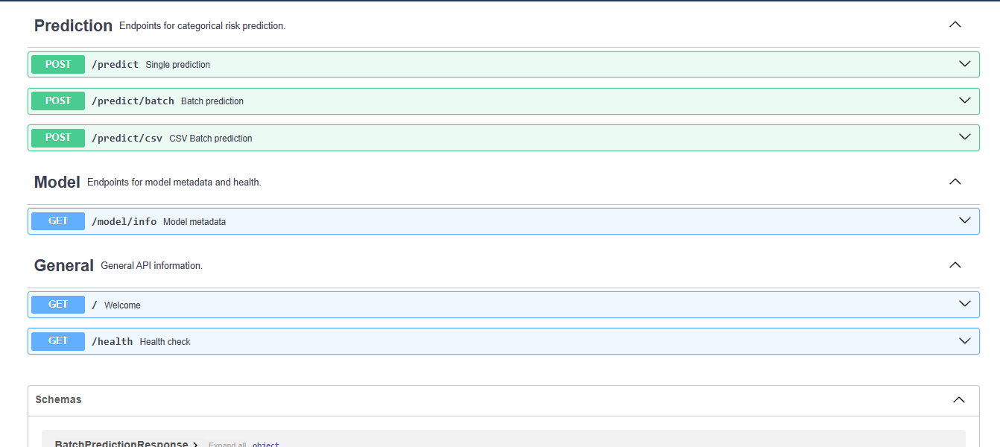
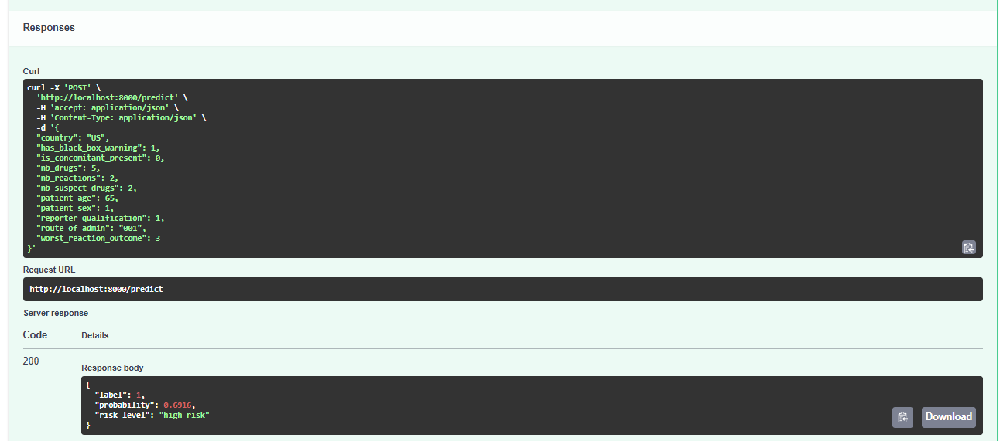
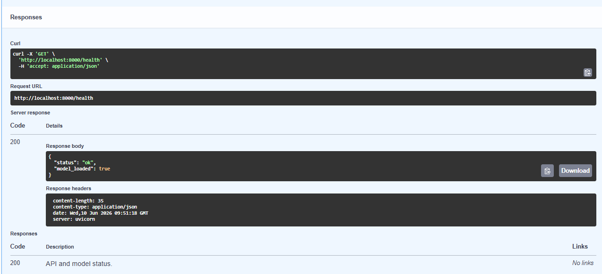
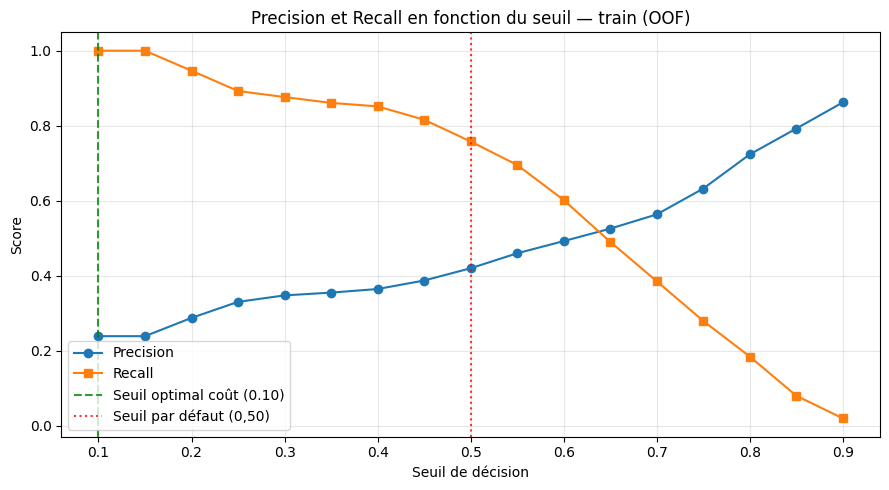
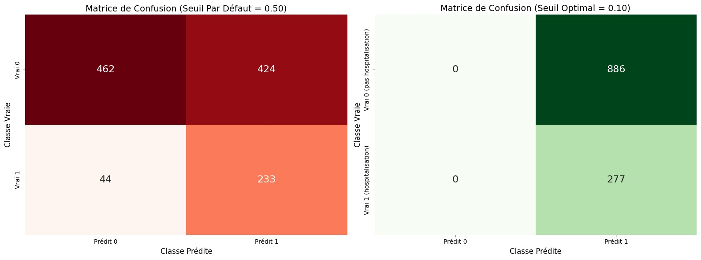

# FAERS Hospitalization Prediction API

> **Projet Machine Learning**
> Prédiction automatique du risque d'hospitalisation à partir des rapports d'effets indésirables openFDA (FAERS).

| Élément | Valeur |
|---|---|
| **Équipe** | Amine El Biyadi · Aya Raissouni · Douae Moeniss |
| **Domaine** | Pharmacovigilance |
| **Problème** | Classification binaire supervisée |
| **Cible** | `seriousnesshospitalization` (0 = pas d'hospitalisation, 1 = hospitalisation) |
| **API source** | [openFDA FAERS](https://open.fda.gov/apis/drug/event/)  et [openFDA Drug Label](https://open.fda.gov/apis/drug/label/) |
| **Modèle** | Random Forest + Undersampling (pipeline scikit-learn) |
| **Métrique principale** | Recall (classe 1) ≥ 0,80 |

---

## Captures d'écran


| Description | Fichier |
|---|---|
| Documentation interactive Swagger | `docs/screenshots/swagger_docs.png` |
| Réponse `/predict` (patient à risque) | `docs/screenshots/predict_high_risk.png` |
| Réponse `/health` | `docs/screenshots/health_check.png` |
| Courbe precision/recall (notebook 05) | `docs/screenshots/threshold_analysis.png` |
| Matrice de confusion test (notebook 06) | `docs/screenshots/confusion_matrix_test.png` |







---

## Arborescence du projet

```
Machine_Learning_Project/
├── app/
│   └── main.py                  # API FastAPI — endpoints /predict, /predict/batch, /predict/csv
├── models/
│   ├── final_model.joblib       # Pipeline complet (préprocesseur + classifieur + métadonnées)
│   └── preprocessor.joblib      # ColumnTransformer ajusté (Phase 2)
├── data/
│   ├── dataset.csv              # Dataset brut (10 000 lignes)
│   ├── sample.csv               # Échantillon 100 lignes
│   ├── raw/                     # JSON bruts collectés via l'API openFDA
│   └── processed/               # train.csv / validation.csv / test.csv (70/15/15 stratifié)
├── notebooks/
│   ├── 01_discovery .ipynb      # Phase 1 — exploration initiale
│   ├── 02_eda .ipynb            # Phase 2 — analyse exploratoire
│   ├── 03_preprocessing.ipynb   # Phase 2 — décisions de prétraitement
│   ├── 03_transformation_pipeline.ipynb  # Phase 2 — pipeline de features
│   ├── 04_modeling.ipynb        # Phase 3 — comparaison 4 modèles × 3 stratégies
│   ├── 05_tuning.ipynb          # Phase 3 — RandomizedSearchCV + optimisation du seuil
│   └── 06_evaluation.ipynb      # Phase 4 — évaluation finale sur test (usage unique)
├── scripts/
│   └── build_feature_pipeline.py
├── data_collection.py           # Script reproductible de collecte openFDA
├── cadrage.md                   # Fiche de cadrage Phase 1
├── DATASET.md                   # Documentation du dataset
├── requirements.txt             # Dépendances figées (versions pinned)
├── Dockerfile                   # Image Docker python:3.11-slim (< 1 Go)
├── docker-compose.yml           # Orchestration du service API
└── README.md                    # Ce fichier
```

---

## Prérequis

- **Docker** ≥ 24 et **Docker Compose** v2 *(recommandé)*  
  **ou** Python **3.11+** avec `pip`

---

## Installation

### Option A — Docker (recommandé)

```bash
# 1. Cloner le dépôt
git clone https://github.com/AmineElBiyadi/Machine_Learning_Project.git
cd Machine_Learning_Project

# 2. Construire et lancer l'API
docker compose up --build -d

# 3. Vérifier que le conteneur tourne
docker compose ps
docker compose logs -f api
```

L'API est disponible sur **http://localhost:8000**.

Vérifier la taille de l'image (< 1 Go) :

```bash
docker images faers-hospitalization-api:1.0.0
```

### Option B — Installation locale

```bash
git clone https://github.com/AmineElBiyadi/Machine_Learning_Project.git
cd Machine_Learning_Project

python -m venv .venv
# Windows
.venv\Scripts\activate
# Linux / macOS
source .venv/bin/activate

pip install -r requirements.txt
uvicorn app.main:app --host 0.0.0.0 --port 8000 --reload
```

---

## Endpoints

| Méthode | Route | Description |
|---|---|---|
| `GET` | `/` | Message d'accueil et liens |
| `GET` | `/health` | Santé de l'API et statut du modèle |
| `GET` | `/model/info` | Métadonnées du modèle chargé |
| `GET` | `/docs` | Documentation Swagger interactive |
| `POST` | `/predict` | Prédiction unitaire (JSON) |
| `POST` | `/predict/batch` | Prédiction par lot (jusqu'à 1 000 enregistrements) |
| `POST` | `/predict/csv` | Upload CSV → CSV avec colonne `prediction_hospitalization` |

---

## Exemples `curl`

### Santé de l'API

```bash
curl -s http://localhost:8000/health | python -m json.tool
```

Réponse attendue :

```json
{
  "status": "ok",
  "model_loaded": true
}
```

### Informations sur le modèle

```bash
curl -s http://localhost:8000/model/info | python -m json.tool
```

### Prédiction unitaire — patient à risque élevé

```bash
curl -s -X POST http://localhost:8000/predict \
  -H "Content-Type: application/json" \
  -d '{
    "patient_age": 78.0,
    "nb_drugs": 12,
    "nb_reactions": 4,
    "nb_suspect_drugs": 3,
    "worst_reaction_outcome": 4,
    "patient_sex": 1,
    "reporter_qualification": 1,
    "has_black_box_warning": 1,
    "is_concomitant_present": 1,
    "route_of_admin": "002",
    "country": "US"
  }' | python -m json.tool
```

Réponse attendue :

```json
{
  "label": 1,
  "probability": 0.7234,
  "risk_level": "high risk"
}
```

### Prédiction unitaire — patient à faible risque

```bash
curl -s -X POST http://localhost:8000/predict \
  -H "Content-Type: application/json" \
  -d '{
    "patient_age": 32.0,
    "nb_drugs": 2,
    "nb_reactions": 1,
    "nb_suspect_drugs": 1,
    "worst_reaction_outcome": 1,
    "patient_sex": 2,
    "reporter_qualification": 5,
    "has_black_box_warning": 0,
    "is_concomitant_present": 0,
    "route_of_admin": "001",
    "country": "FR"
  }' | python -m json.tool
```

### Prédiction par lot

```bash
curl -s -X POST http://localhost:8000/predict/batch \
  -H "Content-Type: application/json" \
  -d '{
    "records": [
      {
        "patient_age": 45.0,
        "nb_drugs": 3,
        "nb_reactions": 1,
        "nb_suspect_drugs": 1,
        "worst_reaction_outcome": 1,
        "patient_sex": 2,
        "reporter_qualification": 5,
        "has_black_box_warning": 0,
        "is_concomitant_present": 0,
        "route_of_admin": "001",
        "country": "FR"
      },
      {
        "patient_age": 67.0,
        "nb_drugs": 8,
        "nb_reactions": 3,
        "nb_suspect_drugs": 2,
        "worst_reaction_outcome": 3,
        "patient_sex": 1,
        "reporter_qualification": 1,
        "has_black_box_warning": 1,
        "is_concomitant_present": 1,
        "route_of_admin": "002",
        "country": "US"
      }
    ]
  }' | python -m json.tool
```

### Prédiction CSV

```bash
curl -s -X POST http://localhost:8000/predict/csv \
  -F "file=@data/sample.csv" \
  -o predictions_output.csv

head -n 5 predictions_output.csv
```

---

## Variables d'entrée

| Champ | Type | Description |
|---|---|---|
| `patient_age` | float | Âge du patient (0–120) |
| `nb_drugs` | int | Nombre total de médicaments (≥ 1) |
| `nb_reactions` | int | Nombre de réactions (≥ 1) |
| `nb_suspect_drugs` | int | Médicaments suspects (≤ `nb_drugs`) |
| `worst_reaction_outcome` | int | Gravité max (1–6, échelle FDA) |
| `patient_sex` | int | 0 = inconnu, 1 = homme, 2 = femme |
| `reporter_qualification` | int | 1–5 (médecin → consommateur) |
| `has_black_box_warning` | int | 0/1 — black box warning FDA |
| `is_concomitant_present` | int | 0/1 — médicament concomitant |
| `route_of_admin` | str | Code FDA (ex. `001` = oral) |
| `country` | str | Code ISO 2 lettres (ex. `FR`, `US`) |

Les features engineering (`ratio_suspect_drugs`, `severity_polypharmacy`, `age_group`) sont calculées automatiquement par l'API.

---

## Résultats clés

| Indicateur | Valeur (test set, seuil optimal 0,10) |
|---|---|
| Recall | **100 %** ✅ (objectif ≥ 80 %) |
| Precision | 23,8 % |
| F1-score | 38,5 % |
| Coût métier total | 19 935 € |

> Le seuil optimal (0,10) minimise le coût asymétrique FN (50 000 €) / FP (22,5 €) défini en Phase 1.

---

## Limites connues du modèle

Ce modèle a été développé dans un cadre pédagogique et présente les limites suivantes :

1. **Biais géographique** : Données principalement issues des États-Unis (FDA), moins représentatif d'autres pays
2. **Bas précision** : Seuil optimisé pour le recall (100 %) entraîne une faible précision (23,8 %) et donc de nombreux faux positifs
3. **Données historiques** : Modèle entraîné sur des données passées, peut ne pas refléter les nouveaux médicaments ou tendances
4. **Pas de validation médicale** : Ne remplace pas l'avis d'un professionnel de santé
5. **Features limitées** : Basé uniquement sur les variables disponibles dans FAERS, sans données cliniques détaillées

**Important** : Ce projet est à des fins éducatives uniquement. **Ne pas utiliser pour des décisions médicales.**

---


## Arrêter les services Docker

```bash
docker compose down
```

---

## Licence & données

### Licence
Ce projet est sous licence **MIT** - voir ci-dessous pour plus de détails.

### Données
- Données : [openFDA](https://open.fda.gov/) — domaine public (US Government Works).
- Ce projet est réalisé dans un cadre pédagogique. **Ne pas utiliser pour des décisions médicales.**

### Licence MIT
```
MIT License

Copyright (c) 2024 Amine El Biyadi, Aya Raissouni, Douae Moeniss

Permission is hereby granted, free of charge, to any person obtaining a copy
of this software and associated documentation files (the "Software"), to deal
in the Software without restriction, including without limitation the rights
to use, copy, modify, merge, publish, distribute, sublicense, and/or sell
copies of the Software, and to permit persons to whom the Software is
furnished to do so, subject to the following conditions:

The above copyright notice and this permission notice shall be included in all
copies or substantial portions of the Software.

THE SOFTWARE IS PROVIDED "AS IS", WITHOUT WARRANTY OF ANY KIND, EXPRESS OR
IMPLIED, INCLUDING BUT NOT LIMITED TO THE WARRANTIES OF MERCHANTABILITY,
FITNESS FOR A PARTICULAR PURPOSE AND NONINFRINGEMENT. IN NO EVENT SHALL THE
AUTHORS OR COPYRIGHT HOLDERS BE LIABLE FOR ANY CLAIM, DAMAGES OR OTHER
LIABILITY, WHETHER IN AN ACTION OF CONTRACT, TORT OR OTHERWISE, ARISING FROM,
OUT OF OR IN CONNECTION WITH THE SOFTWARE OR THE USE OR OTHER DEALINGS IN THE
SOFTWARE.
```

---

## Références


- [openFDA API Documentation](https://open.fda.gov/apis/)
